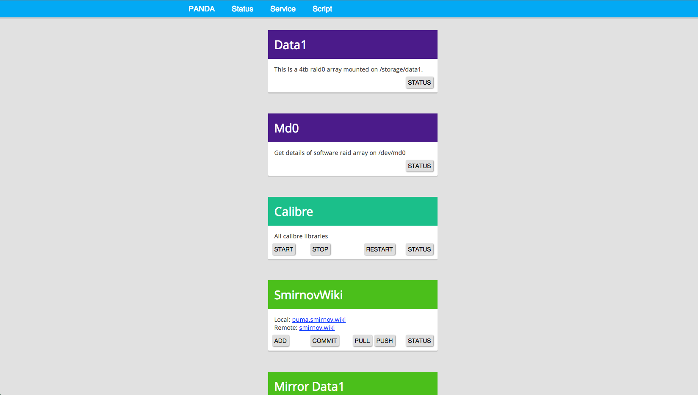
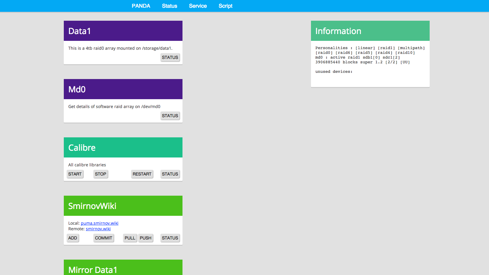
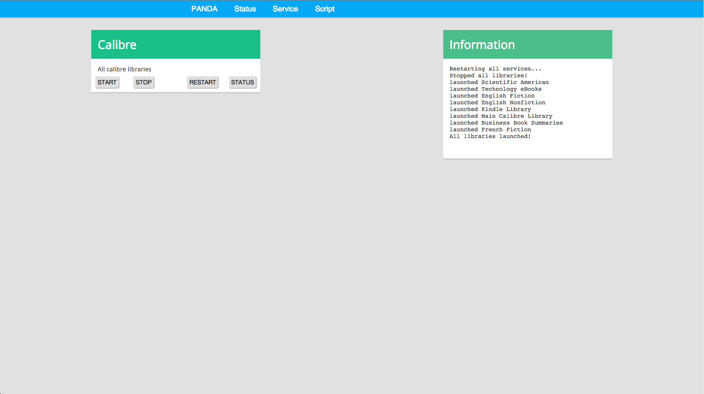
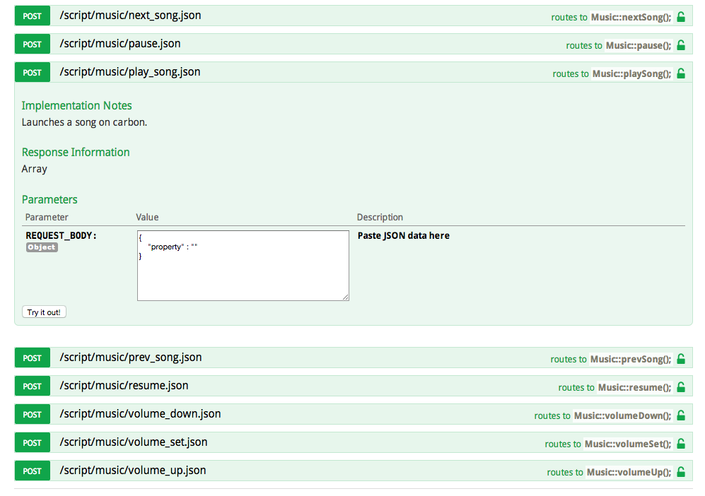

# Panda [1.1.0]
***

`Panda` is a web based admin panel for puma. It features a 
REST api for controlling services on puma and querying system info, 
plus a web frontend that does AJAX calls. It is styllistically based on 
Google's material design.

I have also created a companion Android Wear app, found [here](https://github.com/issmirnov/Panda-AndroidWear)

**Note**: Still under development.

### Screenshot

Raid Status Output:

Calibre Libraries:

Music API:

### Installation

Install a PHP5 enabled web server, then extract the files to the designated
location. Be sure the web user has ownership or at least rwx permissions for everything.

### Usage

Navigate to the url and click around. You can also go to $base_url/api/explorer and take 
a look at the available features.

### Notable Features

- Git repo frontend for a repo of your choice. I've set up mine to track my local Dokuwiki install
- Music API that launches a shell script to SSH in to a desktop and run a script. In my case, this is an AppleScript that controls my music playback.
- Service control - start and stop calibre libraries, Plex, and more.

### FAQ

> Does this work with mobile?

Yes, although the floater is still ugly.

> How is security?

Bad, still figuring out sudoers, root rights, and proxy scripts. I'm thinking about adding an .htaccess or setting up some authentication via the REST api.

#### Contributors

- Ivan Smirnov
- API Engine: [Restler](https://github.com/Luracast/Restler)
